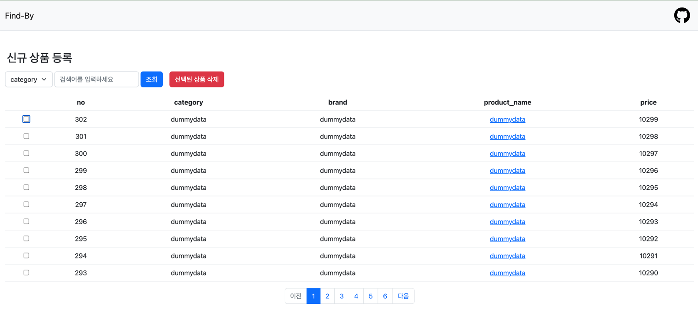

# Find-By
**[stack]**
- python 3.12 & django 5.x & selenium

**[db]**
- sqlite

### Goal
- 내가 kream에서 검색하고 싶은 것을 find-by에서 찾아 볼 수 있다.
- 해당 내용을 검색하면 kream에서 최상단에 있는 아이템을 읽어온다.

 
### Summary
| [x] | [ ] |
|-----|-----|
| 완료  | 미완료 |

- [x] index page


---

- [x] nav


---

- [x] 페이지 네이션

- 31(마지막) 페이지
 
- 30 페이지


---

- [x] 검색어 input을 request body로 사용해 POST 요청 


```python
def search_product(request):
    if request.method == 'POST':
        form = SearchForm(request.POST)
        if form.is_valid():
            content = form.cleaned_data['content']
            data = simp_crawling(words=content)
            if __data_is_valid(data):
                __to_product(data)
            return redirect('findby:index')
    else:
        form = SearchForm()

    context = {'form': form}

    return render(request, 'findby/products.html', context)


def __to_product(data: str) -> None:
    product_info = data.split("\n")
    brand = product_info[1]
    name = product_info[2]
    amount = product_info[5]

    product = (ProductBuilder()
               .set_name(name)
               .set_price(amount)
               .set_category("신발")
               .set_brand(brand)
               .build())

    product.save()


def __data_is_valid(data: str) -> bool:
    if not data:
        return False
    return True
```


---

- [ ] select 한 products의 id를 request body로 POST 요청


---
